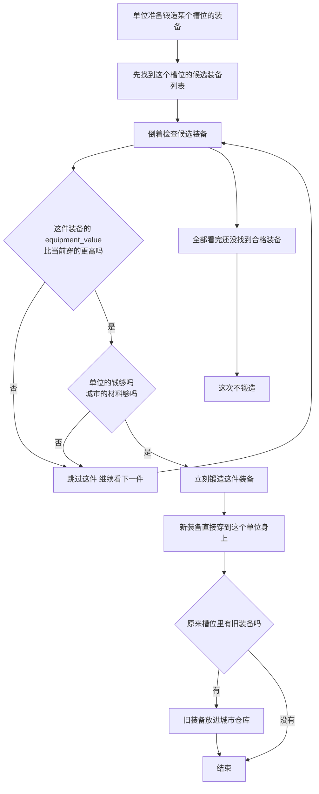

# 轮回装备锻造对比表

## 文档定位
- 这份文档不是只做“哪件装备更贵”的成本对比，它同时承担轮回装备锻造与换装的专题说明。
- 适合用来回答三类问题：这件装备实际怎么扣材、当前轮回装备到底走哪些原版锻造字段、为什么原版会把它判成升级或不升级。
- 装备条目、档位解锁和技能效果看 [轮回阶位详表.md](轮回阶位详表.md)；世界档位和随机参数看 [系统参数总表.md](系统参数总表.md)；整体验证链路看 [../EraWheel_实现口径.md](../EraWheel_实现口径.md)。

## 统计口径
- `MOD` manifest 里的 `crafting.material_id` 不是最终扣除资源。运行时会先把它映射成原版主资源，再写入 `cost_resource_id_1`。
- 当前轮回装备锻造继续只走原版装备字段：`cost_gold`、`cost_resource_id_1/2`、`cost_resource_1/2`、`minimum_city_storage_resource_1`、`cost_coins_resources`。
- 本轮 30 件轮回装备都显式写死 `主材 + 副材 + 金币 + 城市库存门槛`，不再按槽位模板生成，也不再依赖“低阶缺省回退原版参考壳库存门槛”的旧写法。

## MOD 轮回装备锻造明细
结论先说：
- 这次不是“同档统一模板”，而是 30 件装备逐件手工写配方。
- 主材和副材不再允许写成同一种资源。
- 同档 3 件装备现在按“弱 / 中 / 强”分成 3 条成本线，不再一模一样。
- `1-4` 档已经开始出现少量金币门槛；`5-10` 档整体成本明显抬高。
- 顶阶轮回装备现在已经接近原版极端特殊装备区间，但最高档仍略低于 `alien_blaster = 160`。

| 档位 | 装备名 | 内部ID | 槽位 | 实际主资源 | 主材数量 | 副材 | 副材数量 | 金币成本 | 城市库存门槛 | 建议 `equipment_value` |
|---:|---|---|---|---|---:|---|---:|---:|---:|---:|
| 1 | 风暴引线短剑 | `eq_herit_t1_stormwire_blade` | 武器 | 银 | 1 | 石头 | 1 | 3 | 0 | 90 |
| 1 | 芽火戒 | `eq_herit_t1_seedflare_ring` | 戒指 | 木材 | 1 | 宝石 | 1 | 3 | 0 | 85 |
| 1 | 镜壳头盔 | `eq_herit_t1_mirror_shell_helm` | 头盔 | 皮革 | 1 | 银 | 1 | 0 | 0 | 80 |
| 2 | 裂岩震斧 | `eq_herit_t2_quake_axe` | 武器 | 石头 | 1 | 普通金属 | 1 | 8 | 0 | 110 |
| 2 | 虚井护符 | `eq_herit_t2_voidwell_amulet` | 护符 | 普通金属 | 1 | 银 | 1 | 7 | 0 | 105 |
| 2 | 影步战靴 | `eq_herit_t2_shadowstep_boots` | 靴子 | 皮革 | 1 | 银 | 1 | 7 | 0 | 100 |
| 3 | 潮汐折浪矛 | `eq_herit_t3_tide_spear` | 武器 | 银 | 1 | 木材 | 1 | 15 | 0 | 135 |
| 3 | 铁潮重甲 | `eq_herit_t3_iron_tide_armor` | 盔甲 | 普通金属 | 1 | 皮革 | 1 | 14 | 0 | 130 |
| 3 | 瘟雨戒 | `eq_herit_t3_plague_rain_ring` | 戒指 | 骨头 | 1 | 宝石 | 1 | 11 | 0 | 125 |
| 4 | 折光棱弓 | `eq_herit_t4_prism_bow` | 武器 | 秘银 | 2 | 普通金属 | 1 | 24 | 0 | 160 |
| 4 | 霜誓战盔 | `eq_herit_t4_frost_oath_helm` | 头盔 | 秘银 | 1 | 石头 | 1 | 20 | 0 | 155 |
| 4 | 沉默圣印 | `eq_herit_t4_silence_seal_amulet` | 护符 | 秘银 | 1 | 骨头 | 1 | 18 | 0 | 150 |
| 5 | 陨核战锤 | `eq_herit_t5_meteor_hammer` | 武器 | 秘银 | 2 | 石头 | 1 | 40 | 0 | 210 |
| 5 | 林歌披甲 | `eq_herit_t5_grove_plate` | 盔甲 | 木材 | 1 | 秘银 | 1 | 36 | 0 | 200 |
| 5 | 追猎胫甲 | `eq_herit_t5_hunt_greaves` | 靴子 | 皮革 | 1 | 宝石 | 1 | 31 | 0 | 190 |
| 6 | 星核法杖 | `eq_herit_t6_starcore_staff` | 武器 | 秘银 | 2 | 宝石 | 1 | 58 | 0 | 260 |
| 6 | 白骨王冠 | `eq_herit_t6_bone_crown` | 头盔 | 骨头 | 1 | 爱德曼 | 1 | 51 | 0 | 250 |
| 6 | 逆流戒 | `eq_herit_t6_reflux_ring` | 戒指 | 银 | 1 | 宝石 | 1 | 47 | 0 | 240 |
| 7 | 雷狱枪 | `eq_herit_t7_thunder_prison_gun` | 武器 | 普通金属 | 1 | 艾德曼 | 2 | 78 | 0 | 350 |
| 7 | 界墙胸铠 | `eq_herit_t7_wall_armor` | 盔甲 | 银 | 1 | 艾德曼 | 1 | 70 | 0 | 335 |
| 7 | 瞬界符 | `eq_herit_t7_blink_sigil` | 护符 | 秘银 | 1 | 皮革 | 1 | 65 | 0 | 320 |
| 8 | 深渊龙卷刃 | `eq_herit_t8_abyss_tornado_blade` | 武器 | 龙鳞 | 2 | 骨头 | 1 | 98 | 0 | 440 |
| 8 | 审判回路戒 | `eq_herit_t8_verdict_circuit_ring` | 戒指 | 秘银 | 1 | 宝石 | 1 | 94 | 0 | 420 |
| 8 | 日珥战靴 | `eq_herit_t8_solar_flare_boots` | 靴子 | 龙鳞 | 1 | 皮革 | 1 | 79 | 0 | 400 |
| 9 | 天罚弧弓 | `eq_herit_t9_heaven_arc_bow` | 武器 | 艾德曼 | 3 | 秘银 | 2 | 112 | 0 | 580 |
| 9 | 王城冠冕 | `eq_herit_t9_crown_of_cities` | 头盔 | 艾德曼 | 2 | 银 | 2 | 112 | 0 | 550 |
| 9 | 无光圣匣 | `eq_herit_t9_black_sun_amulet` | 护符 | 骨头 | 2 | 宝石 | 2 | 112 | 0 | 520 |
| 10 | 终局圣枪 | `eq_herit_t10_final_lance` | 武器 | 艾德曼 | 3 | 秘银 | 2 | 130 | 0 | 760 |
| 10 | 万象王铠 | `eq_herit_t10_omni_king_armor` | 盔甲 | 艾德曼 | 3 | 龙鳞 | 2 | 126 | 0 | 720 |
| 10 | 轮回奇点戒 | `eq_herit_t10_cycle_singularity_ring` | 戒指 | 秘银 | 2 | 宝石 | 2 | 136 | 0 | 680 |

## 原版最高级装备对比

### 原版常规顶档装备
这张表只看原版常规锻造序列的顶档，也就是 `mythril / adamantine` 两层。

| 中文名 | 内部ID | 类别 | 材质档 | 主材 | 主材数量 | 副材 | 副材数量 | 金币成本 | 城市库存门槛 | `equipment_value` |
|---|---|---|---|---|---:|---|---:|---:|---:|---:|
| 秘银剑 | `sword_mythril` | 武器-刀剑 | 秘银 | 秘银 | 1 | 无 | 0 | 0 | 0 | 50 |
| 艾德曼剑 | `sword_adamantine` | 武器-刀剑 | 艾德曼 | 艾德曼 | 1 | 无 | 0 | 0 | 0 | 70 |
| 秘银弓 | `bow_mythril` | 武器-弓箭 | 秘银 | 秘银 | 1 | 无 | 0 | 0 | 0 | 50 |
| 艾德曼弓 | `bow_adamantine` | 武器-弓箭 | 艾德曼 | 艾德曼 | 1 | 无 | 0 | 0 | 0 | 70 |
| 秘银斧 | `axe_mythril` | 武器-斧头 | 秘银 | 秘银 | 1 | 无 | 0 | 0 | 0 | 50 |
| 艾德曼斧 | `axe_adamantine` | 武器-斧头 | 艾德曼 | 艾德曼 | 1 | 无 | 0 | 0 | 0 | 70 |
| 秘银矛 | `spear_mythril` | 武器-长矛 | 秘银 | 秘银 | 1 | 无 | 0 | 0 | 0 | 50 |
| 艾德曼矛 | `spear_adamantine` | 武器-长矛 | 艾德曼 | 艾德曼 | 1 | 无 | 0 | 0 | 0 | 70 |
| 秘银锤 | `hammer_mythril` | 武器-锤子 | 秘银 | 秘银 | 1 | 无 | 0 | 0 | 0 | 50 |
| 艾德曼锤 | `hammer_adamantine` | 武器-锤子 | 艾德曼 | 艾德曼 | 1 | 无 | 0 | 0 | 0 | 70 |
| 秘银头盔 | `helmet_mythril` | 防具-头盔 | 秘银 | 秘银 | 1 | 无 | 0 | 0 | 0 | 50 |
| 艾德曼头盔 | `helmet_adamantine` | 防具-头盔 | 艾德曼 | 艾德曼 | 1 | 无 | 0 | 0 | 0 | 70 |
| 秘银胸甲 | `armor_mythril` | 防具-盔甲 | 秘银 | 秘银 | 1 | 无 | 0 | 0 | 0 | 50 |
| 艾德曼胸甲 | `armor_adamantine` | 防具-盔甲 | 艾德曼 | 艾德曼 | 1 | 无 | 0 | 0 | 0 | 70 |
| 秘银战靴 | `boots_mythril` | 防具-靴子 | 秘银 | 秘银 | 1 | 无 | 0 | 0 | 0 | 50 |
| 艾德曼战靴 | `boots_adamantine` | 防具-靴子 | 艾德曼 | 艾德曼 | 1 | 无 | 0 | 0 | 0 | 70 |
| 秘银戒指 | `ring_mythril` | 饰品-戒指 | 秘银 | 秘银 | 1 | 宝石 | 1 | 0 | 0 | 50 |
| 艾德曼戒指 | `ring_adamantine` | 饰品-戒指 | 艾德曼 | 艾德曼 | 1 | 宝石 | 1 | 0 | 0 | 70 |
| 秘银护符 | `amulet_mythril` | 饰品-护符 | 秘银 | 秘银 | 1 | 宝石 | 1 | 0 | 0 | 50 |
| 艾德曼护符 | `amulet_adamantine` | 饰品-护符 | 艾德曼 | 艾德曼 | 1 | 宝石 | 1 | 0 | 0 | 70 |

### 原版最贵特殊可锻造装备
这张表看的是原版能直接在 `ItemLibrary.initWeaponsUnique()` 里找到的高成本特殊装备。

| 中文说明 | 内部ID | 类别 | 主材 | 主材数量 | 副材 | 副材数量 | 金币成本 | `equipment_value` |
|---|---|---|---|---:|---|---:|---:|---:|
| 外星爆能枪 | `alien_blaster` | 枪械-特殊 | 艾德曼 | 10 | 宝石 | 20 | 100 | 500 |
| 霰弹枪 | `shotgun` | 枪械-特殊 | 艾德曼 | 10 | 秘银 | 5 | 100 | 600 |
| 火焰战锤 | `flame_hammer` | 武器-特殊 | 龙鳞 | 3 | 无 | 0 | 10 | 400 |
| 寒冰战锤 | `ice_hammer` | 武器-特殊 | 秘银 | 10 | 宝石 | 2 | 10 | 400 |
| 火焰剑 | `flame_sword` | 武器-特殊 | 龙鳞 | 2 | 无 | 0 | 0 | 300 |
| 死灵法杖 | `necromancer_staff` | 法杖-特殊 | 秘银 | 2 | 宝石 | 3 | 10 | 500 |
| 邪恶法杖 | `evil_staff` | 法杖-特殊 | 秘银 | 3 | 宝石 | 2 | 20 | 500 |
| 白法杖 | `white_staff` | 法杖-特殊 | 秘银 | 3 | 宝石 | 2 | 20 | 500 |
| 瘟疫医生法杖 | `plague_doctor_staff` | 法杖-特殊 | 秘银 | 2 | 宝石 | 1 | 5 | 200 |
| 德鲁伊法杖 | `druid_staff` | 法杖-特殊 | 秘银 | 3 | 宝石 | 1 | 7 | 300 |

## 原版锻造逻辑怎么理解
这一段按原版 `ItemCrafting` 的真实流程写，专门给第一次看这套系统的人用。

先记一句人话版：
- 不是“城镇先自动造一堆装备，再让大家去领”。
- 更像“某个单位自己发起锻造，借城里的材料，用自己的钱，现场给自己换一件更好的装备”。

### 新人版流程图

### 一步一步看
- 第一步，系统不是先看“总成本高不高”，而是先看这件装备的 `equipment_value`。
- 第二步，只有当 `equipment_value` 比当前装备更高时，这件装备才有资格继续往下判定。
- 第三步，接着才检查两个条件：这个单位自己的钱够不够，这个城市当前仓库里的材料够不够。
- 第四步，只要都够，就马上造出来；不会专门帮你“先攒材料，等更高级那件”。
- 第五步，新装备会直接穿到这个单位身上。旧装备如果被换下来，才会进城市仓库。

### `equipment_value` 到底是什么
- 可以把 `equipment_value` 理解成“这件装备模板的基础档次分”。
- 锻造时，系统看的是这个“基础档次分”，不是这件成品当前的实际身价。
- 实际身价会受到词条影响，所以有可能出现“极品铁剑实际更值钱，但银剑模板档次更高”的情况。
- 这时原版锻造仍可能判定“银剑是升级”，因为它优先看 `equipment_value`，不是先看成品最终价值。

### 最容易误会的 3 件事
- 不是按“总成本”从高往低挑，而是按候选表顺序，找第一件“比当前更强且资源够”的装备。
- 不是“平替也会造”。如果候选装备的 `equipment_value` 和当前一样，或者更低，这件就不会造。
- 不是“城市会帮你存着材料等毕业装”。城里只要现在材料够，前面那件装备就可能先把材料花掉。

### 为什么会出现“高档装备一直攒不出来”
可以把它想成存钱买东西：
- 你本来想攒 `3` 块钱买大件。
- 但系统每次刚攒到 `1` 块钱，就先买了一个小件。
- 结果钱一直到不了 `3`。

放到锻造里也是一样：
- 低档装备要 `银 x1`
- 高档装备要 `银 x3`
- 如果低档装备已经算“比当前更好”，那城市一拿到 `1` 个银，就可能先被低档装备用掉。
- 这样高档装备需要的 `3` 个银，就会更难真正攒齐。
